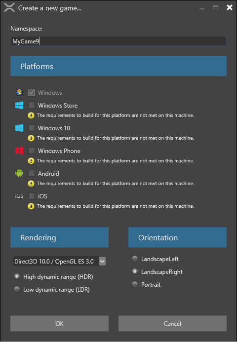
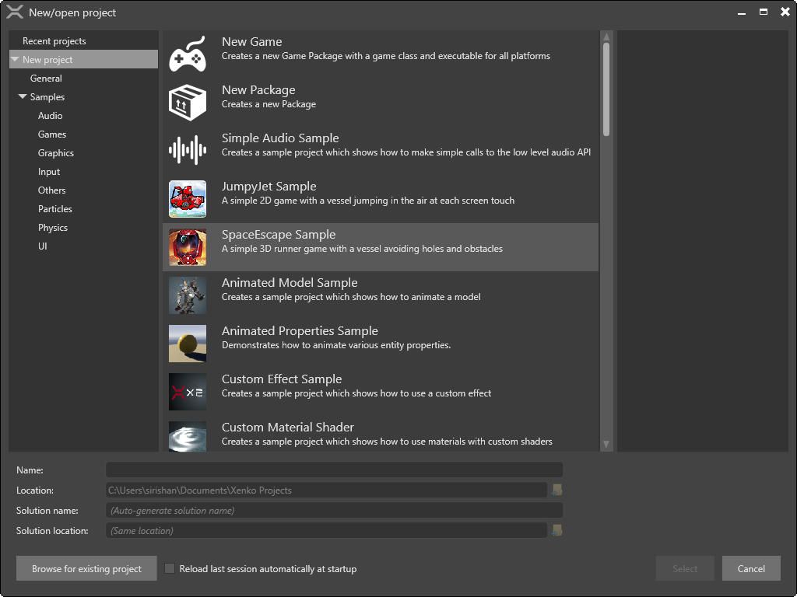

# Create a project

We have discussed various features of the [Xenko Launcher](XenkoLauncher.md). Now, let us create a new project in the Xenko Game Studio.

**To create a new project:**

 1.	Click the Start button on the Xenko Launcher.
 
     
	
    _Start button of Xenko Studio_

	The **New/open project** window opens.
	
     
	
    _New/open project window_
	
 2.	Click **New Game**. The **Create a new game** window opens. This window helps in configuring the new project.
     
    _Create a new game_
	
 3.	Type the name to be given to your new game within the **Namespace** box.
 4.	Select the platform on which you want to create a game from the **Platforms** section, by selecting the check box before the platform name. If your system does not have a particular platform requirement, a warning message is displayed.

 >**Note:** A project can be created using iOS and Android platforms, but a Xamarin license is required to build your game on iOS or Android.

 5.	Select the configurations for graphic API and colors from the **Rendering** section.
 
    i.	**Graphic API** – This is the API that is to be targeted while creating the project. Select the required graphic API from the drop-down list. The graphic features are dependent on the API selected. For advanced graphic features, select latest graphic API.
    >**Note:** All the graphic cards do not support latest APIs. So select the APIs accordingly. For mobile devices, restrict the selection to profile 9_1 or profile 10_0.

	ii.	**Colors** – Select the range of colors that are to be used while creating a game. There are two ranges for colors. LDR (Low Dynamic Range) ranges from 0 to 1. HDR (High Dynamic Range) allows any random float values. HDR gives more possibilities but is complex.
	
 6. Select the required orientation from the **Orientation** section.

  >**Note:** Orientation for PC based games is landscape, but orientation of mobile based games can be mostly portrait.

 7. Click **OK**. A new game is created and opened in **Xenko Game Studio**.
  
  >**Note:** All the configurations done while creating a new project can also be changed in the Xenko Game Studio whenever required.

You have successfully created a new project.

While creating a new project you can also:

  * View **Recent Projects**, open, and start working with them.
  *	Creates a simple and functional **New Project** by selecting a new game template.
  *	Creates a **New Package**. A game package is not a game, but a library of components as assets, scripts, and so on. A game package is not an executable file as a game, but it can be shared between different projects with its components.
  *	Explore the **Samples** provided for graphics, audio, physics, UI, and so on along with two complete sample games: JumpyJet, a 2D scrolling game, and SpaceEscape, a 3d runner game. Feel free to check and explore these samples which helps you learn how to work with Xenko Gaming Engine.

Now let us add some components to the game in the [Xenko Game Studio](XenkoGameStudio.md).
