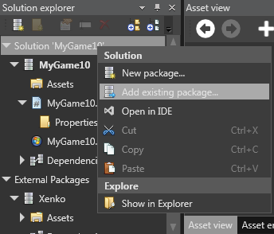

# Project organization

We have discussed how to [create a project](http://doc.xenko.com/latest/manual/getting-started/howto-create-and-setup-new-game.html) in the Xenko Studio. In this topic, let us discuss how a Xenko project is organized.

## Package

Xenko uses a package system. In this system, each game is contained in a package and can use contents from other packages as well. Thus, sharing resources across multiple games becomes possible.

A package is basically a game or a container for game assets, code libraries, and dependencies. A dependency is a reference from one package to another package, which allows another package using the contents from this package. When a package is a game, it also contains code executables (one per platform) along with game assets, code libraries, and dependencies.

Packages are saved on a disk with the .xkpkg extension.

   

   *Solution explorer*
 
You can add an existing package to your package.

To add an existing package to your package, just right-click the Solution bar in the **Solution explorer** and select the **Add existing package...** option. Then select the required package on your system.
 
   

   *Add an existing package*

## Project

In the Xenko Studio, a project means simply a game project.

In the Xenko Studio, you can create a new game package, a new package, and various types of sample games.

>**Note:** After you create a new project in the Xenko IDE, Xenko creates a Visual Studio application at the same location on your machine. The Visual Studio application includes the **Assets**, **Bin**, and **Resources** folders similar to a .NET application.

##Solution

The solution explorer displays the hierarchy of your game.

   

   *Solution explorer*
 
Each package is separated into two categories, namely Local packages and External packages.

External packages are the packages that you downloaded from the Internet, for example, the default Xenko package. Local packages are your own packages that you created.

If you open a package file (.xkpkg), you should see a single package of the Local package category. If you open a solution file (.sln), you may see several packages if the solution contains more than one package.

Each package contains the following three base elements:

**Assets:** The assets element contains all the assets contained in a package. You can expand the assets element to see the same hierarchy among the assets that is on the file system. When you select the **Assets** folder, the Asset view displays the assets contained in this folder.

**Code:** The code element contains the code libraries and executables in the package. They each correspond to a single .csproj file. By right-clicking an executable, you can set it as the current project that allows you to compile the assets for the related platform and launch the game.

**Dependencies:** The dependencies element lists all the other packages that are referenced by this package. The packages in the **Dependencies** list have their assets accessible to this package.

>**Note:** You can change the hierarchy in the **Solution explorer** by creating folders, and renaming or deleting objects.

Xenko uses Visual Studio solution files to list all the packages and code project related to a game. Thus, you can easily integrate the Xenko Studio and Visual Studio together, as they use the same root file for your project. By default, the Xenko Studio creates a new solution file when you create a new project, and manages references to both C# projects and packages.

## Assets

Assets are the objects used in your game, such as data, meshes, textures, materials, and sounds. Most of the assets are generated while importing a source file, for example, while importing an audio file or a 3D model. Assets can also be created from scratch, such as entities. For each asset, a single file is created, usually with an extension starting by .xk. For example, the texture asset uses the .xktex extension. You can sort assets into folders and subfolders for easy access. The root path of the assets of a package is stored in the package file.

You can create and browse assets in the asset view.

   

   *Asset view*
 
>**Note:** You can import existing assets such as FBX files. You can then edit those assets in the Property grid.
 
   

   *Property grid*

## Resources

Resources are images, textures, and entity images used in your game. Resources are stored in the **Resources** folder of a game application.

   

   *Resources folder*
  
>**Note:** As a best practice, all data resources should be moved inside the **Resources** folder so as to move your project easily. If resources are outside of the project, moving the project breaks the links and compiler issues can occur.
