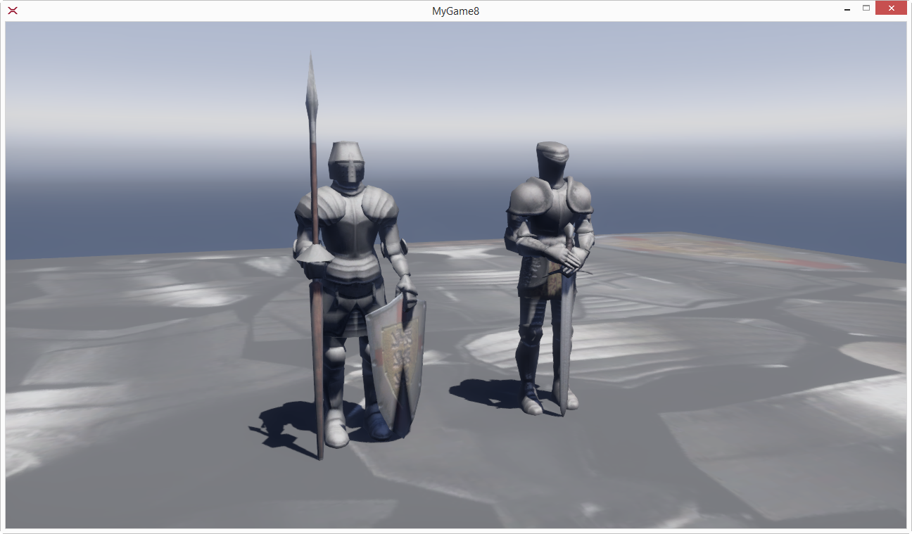

# Create a basic scene

In this topic, you will learn how to create a basic scene in **Xenko Game Studio**.

You can create a basic scene in two simple steps. First, you need to add the required entities into the scene, and then execute your scene. This topic provides the steps to add entities and execute the scene.

## Add entities

Objects in a scene are called **Entities**. Each entity can have one or more components, such as model component, audio component, and other components.
>**Note:** Before you create a scene, you need to import some assets to your game. For more information about creating or importing assets, see [Create assets](http://doc.xenko.com/latest/manual/getting-started/howto-create-or-import-asset-data.html) or [Import assets](http://doc.xenko.com/latest/manual/getting-started/howto-create-or-import-asset-data.html).

### Add entity to scene

A simple and easy way to add an entity to your scene is adding an entity from the **Asset View**. First, select the desired entity from the **Asset View**, drag and place that entity on the **Asset View Port** on the Main Scene. You can add entities, such as model, prefab, texture, and other entities. For more ways on how to add entities, see [Add entities to a scene](getting-started/add-entities-to-scene.md).

>**Note:** While adding a new entity, corresponding components, such as model, texture, and other entities, are created automatically.

For more information on how to navigate in a scene, see [Navigate in a scene](getting-started/navigate-in-a-scene.md).

## Execute a scene

You have added the required entities and components to your scene. Now you can execute your scene.

Click the  button displayed below the Menu bar or Press **F5**. This action builds the assets and launches your game.

    
   _Executed game scene_

   In the above game scene, you can see the object added with a proper camera and some lighting. But the object is still static. To make the object move, you need to add scripts and animations. For more information about adding scripts and animations to your scene, see [Use scripts](http://doc.xenko.com/latest/manual/getting-started/howto-use-scripts.html).
