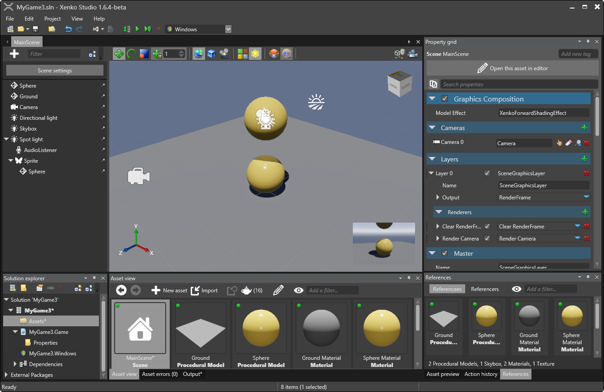
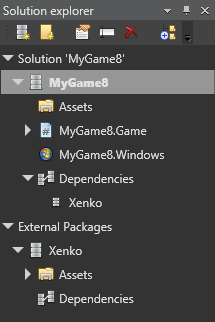
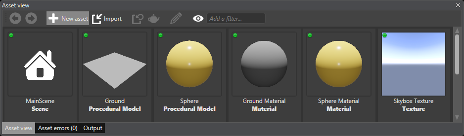
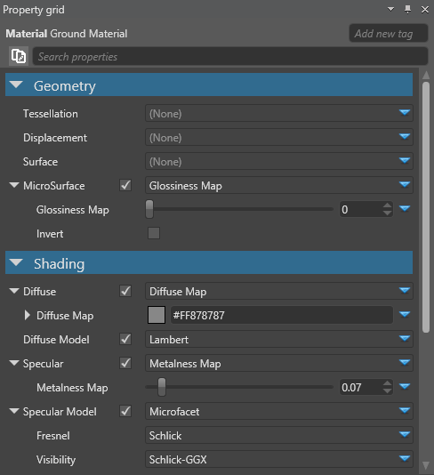
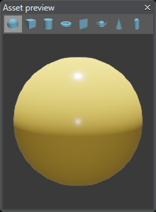
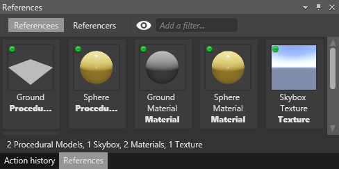
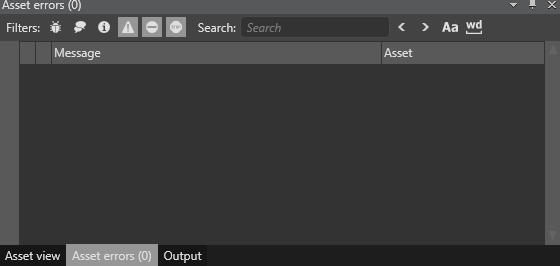
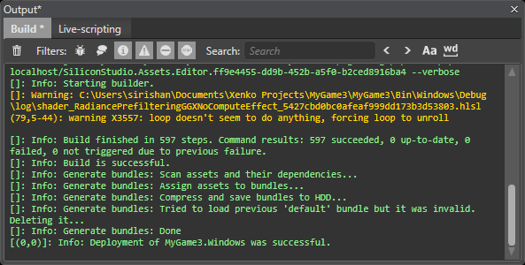
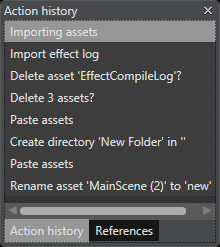

# Game Studio Interface

You can open your project in the Game Studio Interface.

_Main Interface of Game Studio window_

The main interface of the **Game Studio** includes the following sections:

## Solution explorer

The **Solution explorer** section displays the [hierarchy](http://doc.xenko.com/latest/manual/getting-started/game-project-hierarchy.html) of your game. 
 

_Solution explorer window_

The **Solution explorer** helps you to create or add packages to your solution, or add C# projects to your packages. You can also modify the hierarchy by creating folders, renaming or deleting objects, and so on.

The packages in the Solution explorer are divided into two categories:
 * **Local packages**: Packages that are created by you.
 * **External packages**: Packages that are downloaded from the Internet.
 >**Note:** A package file (``.xkpg``) contains single package, whereas a solution file (``.sln``) contains several packages. Each package contains three base elements.

Different elements of **Solution explorer**:
 * **Assets**: This element contains all the assets of a package. Expand it to see the hierarchy between the assets. Select the **Asset** folder to view all the assets in **Asset view**.

 * **Code**: This element contains all the code libraries, and executables of the package, corresponding to a single file. Set an executable as current project by right-clicking it, which allows you to compile the assets for the related platform and launch the game.

 * **Dependencies**: This element contains all the other external packages that refer to this package. The assets of the external packages are accessible to this package.

## Asset view

The **Asset view** section displays all the assets of the game.

_Asset view window_

The **Asset view**:
 * Displays assets in tile view with thumbnails, or in a more compact grid view.
 * Provides tools for searching or filtering assets in the toolbar.
 * Creates new assets or imports assets.
 
## Property grid
The **Property grid** section displays the properties of the selected asset.

_Property grid window_

If multiple assets are selected, common properties are displayed. Behavior of an asset or the way the asset is imported can be changed by changing the values in the **Property grid**.

## Asset preview 

The **Asset preview** section displays the asset as the way it is rendered in the game.

_Asset preview window_

The preview depends on the type of the asset selected. For a model, all the materials of the model are displayed, and the camera can rotate around the model. For animations and sounds, it is possible to playback and to seek with a timeline. You can only preview the asset, but you cannot edit an asset.

## References

The **References** section displays the references between various assets.

_References_

There are two tabs displayed in the **References** section:

 * **Referencees**: Displays all the assets that are required by the selected asset. For example, if a model is selected, all the materials and textures that are required by that model to render correctly are displayed.

 * **Referencers**: Displays all the assets that require the selected asset. For example, if a texture is selected, all the materials, models, and entities that need this texture are listed.

## Asset error

The **Asset error** section displays warnings or errors for the assets in your project, such as, invalid properties, broken references, and so on. 

_Asset errors window_
 
## Output

The **Output** section displays the output errors or warnings while building a project.

_Output window_

The **Output** section displays two tabs:

 * **Build**:  Displays the log and errors that are related to asset and script, while building the project.
 * **Live-scripting**: This is a special mode where, while running your game, there is a facility to edit the script and it automatically updates the script without relaunching the game.

## Action history

The **Action history** section displays the history of all the actions done.
 

_Action history window_

It displays a list of all actions that are done in a game. There is an option to undo or redo any of the actions.
