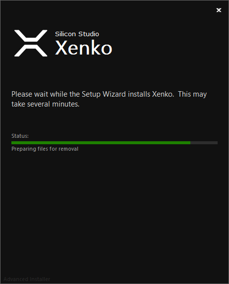

# Install Xenko

This topic provides the steps to download and install Xenko Gaming Engine on your system. 

## Download 

To install Xenko, you must first download the application from the Xenko website.

Xenko website has a [DOWNLOAD](http://xenko.com/download/) page which includes pre-requisites for download, such as platform requirements, system requirements, licensing, and installer details. Click the **DOWNLOAD** button.

The Xenko application setup file gets downloaded.

## Install 

Now, as the Xenko setup file is downloaded, we can install the application.

**To install Xenko:**

 1. Double-click the **XenkoSetup.exe** file. 
    
    The Xenko Setup Wizard opens.
	
	 
    
	_Xenko Setup Wizard_

 2. Click **Next**.

    The **Xenko License Agreement** window opens.
	
    
	
	_Xenko License Agreement window_

 3. Click **Accept**.

    The **Xenko installation type** window opens.
	
     
    
	_Xenko installation type window_

 4. Select the option for the required installation type, and then click **Next**.
    The **Select installation folder** window opens.

    
    
	_Select installation folder_

    The **Folder** text box displays the default path to install Xenko. To change the path, click  and select the required path.

 5. Click **Next**.

    The **Create application shortcuts** window opens.
	
    
    
	_Create application shortcuts window_

 6. Select the required options to create shortcuts, and then click **Next**.

    The **Ready to Install** window opens.

     
    
	_Ready to Install window_

 7. Click **INSTALL**.

    The **Installation window** opens.

     
    
	_Installation status_

After installation is complete, the **Xenko Launcher** opens.

For more information about Xenko Launcher, see [Xenko Launcher](xenko-launcher/index.md).
