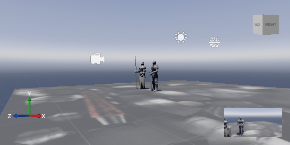

# Navigate in a scene

In this topic, we will discuss how to navigate in a scene in the Xenko Studio. Xenko provides you some inbuilt navigation keys as well as some mouse-click and key combinations that you can use to easily navigate in the scene.

## Focus on an entity

To focus on an entity, first you need to select that entity with a mouse-click. Then, press the **F** key.

   
   
   _Entity before focus_

   
   
   _Entity after focus_

## Move orbital screen

In the Xenko Studio, orbital screen simply means the Viewport.

To move the orbital screen:

* **Forward:** Keep the left or middle or right mouse button pressed and press the **W** key. Alternatively, you can press the **Up** arrow key.
* **Backward:** Keep the left or middle or right mouse button pressed and press the **S** key. Alternatively, you can press the **Down** arrow key.
* **To the left:** Keep the left or middle or right mouse button pressed and press the **A** key. Alternatively, you can press the **Left** arrow key.
* **To the right:** Keep the left or middle or right mouse button pressed and press the **D** key. Alternatively, you can press the **Right** arrow key.
* **Downward:** Keep the left or middle or right mouse button pressed and press the **Q** key.
* **Upward:** Keep the left or middle or right mouse button pressed and press the **E** key.

>**Note:** To speed up your orbital screen movement, press the **Shift** button while you do the combinations mentioned in the preceding list. For example, to move the orbital screen to the left faster, keep the **Shift** key and the left or middle or right mouse button pressed while you press the **A**  key.

## Orbital camera

The orbital camera helps you view an entity on the Viewport from various angles. The orbital camera moves only when the **Alt** key is pressed along with the left or middle or right mouse button click.

   
   
   _Orbital camera_

## View entity from various angles

You can view an entity from various angles using the **Orthographic Projection** and **Perspective Projection** of the orbital camera. 

To view an entity from various angles:

1. Click the orbital camera from the gizmos.
2. Select the **Perspective** or **Orthographic** projection.
3. Click the required orientation (**Front**, **Back**, **Top**, **Bottom**, **Left**, **Right**).

   
   
   _Projection and orientation_

>**Note:** A convenient combination to view an entity in different angles is to select the entity, focus with the key **F**, and rotate around with the orbital cam.
   
The XYZ axes in the bottom-left corner help you for orientations.

* **X-Axis:** Defines the X-axis orientations
* **Y-Axis:** Defines the Y-axis orientations
* **Z-Axis:** Defines the Z-axis orientations

   
   
   _XYZ axes_

The cube in the top-right corner is helps you easily change between top, left, right, and bottom views.

   
   
   _Cube_