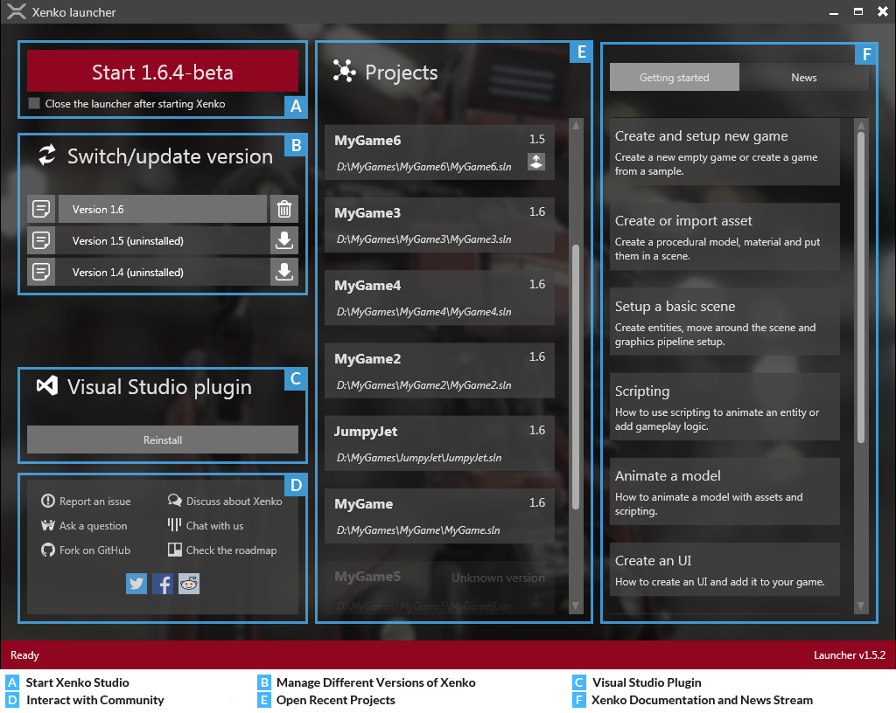

# Xenko launcher

The launcher is the starting point of Xenko. With the launcher, you can:

* Start Xenko Studio
* Manage the different versions of Xenko
* Reinstall the Xenko Visual Studio plugin
* Open your recent Xenko projects
* Access Xenko documentation and news streams
* Interact with the Xenko communities

The following image shows the Xenko launcher interface.

   

   *Xenko launcher interface*
	
You can start Xenko Studio by clicking the Start button to start the currently displayed version of Xenko. The launcher allows you to choose the Xenko version.

After the Xenko installation is over, click the required version button, and then click the Start button. The Xenko Studio is launched.

Once you download your first Xenko SDK, the launcher prompts you to install the Xenko Visual Studio plugin. It is not mandatory to install this plugin. However, we highly recommend you to install it.

You can open your recent Xenko projects from the **Projects** section, just by a click. Your latest Xenko project is always displayed at the top of this list.

You can access various getting started topics of Xenko Manual and news streams related to Xenko from the **Getting started** and **News** section.

You can also easily connect with the various Xenko communities from the launcher.

For more detailed information about the various sections of the launcher, see [Work with Xenko launcher](/manual/xenko-launcher/index.md).