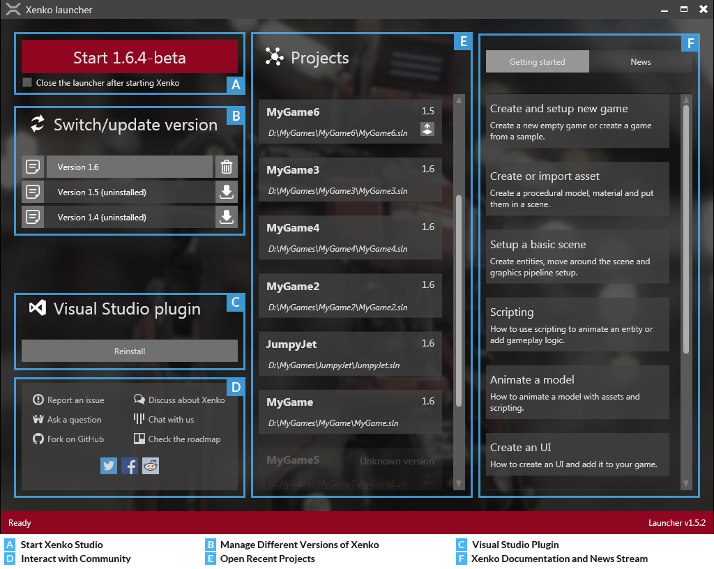
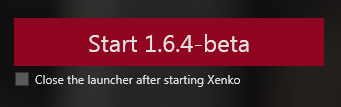
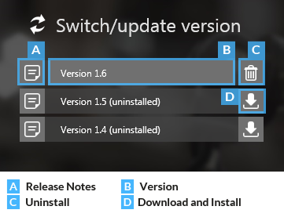
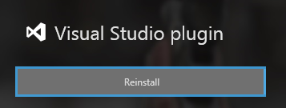
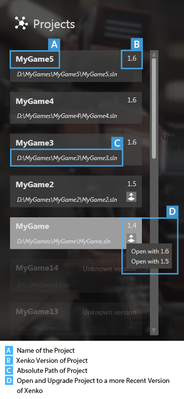
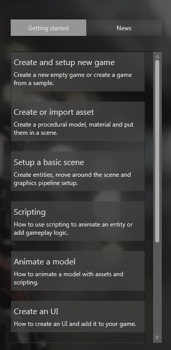
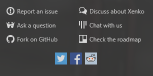

# Xenko launcher

The Xenko launcher helps you manage various versions of Xenko and start the Xenko Studio.

Using the Xenko launcher, you can:

* Start Xenko Studio
* Manage different versions of Xenko Studio
* Reinstall the Microsoft Visual Studio plugin
* Open your recent Xenko projects quickly
* Access Xenko documentation and news streams
* Interact with the Xenko communities

   

   *Xenko launcher interface*
	
## Start Xenko Studio

You can start Xenko Studio from this section.

On the Start button, you can see the currently installed version of Xenko Studio. Click the Start button to start the displayed version of Xenko.

   
   
   *Start button of Xenko launcher*

>**Note:** Select the **Close the launcher after starting Xenko** check box to close the launcher after the Xenko Studio starts.

## Switch or update versions

Xenko launcher can manage different versions of the Xenko SDK.

There are the following versions of Xenko:

* **Major** – It is a major update to the software.
* **Minor** – It is a small update to the software.
* **Bug fix** – It is any change made to the software, for example, bug fixes and small updates.

Xenko launcher allows you to choose a version because breaking changes happen between two versions and you may not necessarily want to update your game.

>**Note:** While updating an existing version, you can choose between a major (1.x.x) and a minor (1.1.x) version to install. However, you cannot revert to a bug fix version (1.1.1) once installed.

When the Xenko installation is over, click the required version button and then click the Start button. The Xenko Studio is launched.

* Click the release notes button to view the release notes of a Xenko version.
* Click the download and install button to install the required Xenko version. 
* Click the uninstall button to uninstall a Xenko version.

   

   *Various versions of Xenko*
	
## Visual Studio plugin

After you download your first Xenko SDK, the launcher prompts to install the Visual Studio plugin. Installing this plugin is not mandatory. However, we highly recommend you to install it. Thanks to this plugin, you can edit your shaders directly from Visual Studio.

This plugin provides:

* syntax highlighting
* live-code-analysis with validation
* error-checking
* navigation (jump to definition)

If you manually remove the Visual Studio plugin, you can always install it again with the **Reinstall** button.

   
   
   *Visual Studio plugin*
	
## Recent projects

You can open your recent Xenko projects from this section just by a click. Your latest Xenko project is always displayed at the top of this list.

   
   
   *Projects section*
	
## Getting started and news

You can access various getting started topics of Xenko Manual and news streams related to Xenko from this section.

Click the **Getting started** tab to view the help topics. To view news streams, click the **News** tab.

   
   
   *Getting started and News section*

## Xenko community

From this section, you can interact with the Xenko community.

   

   *Interacting options*