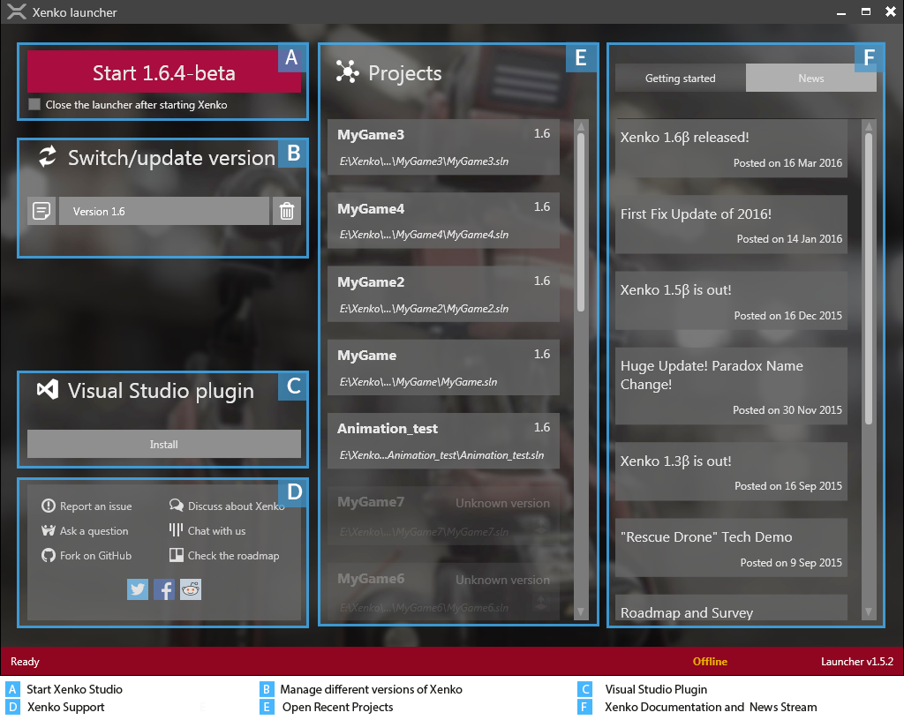
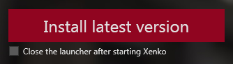
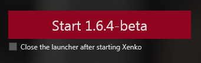
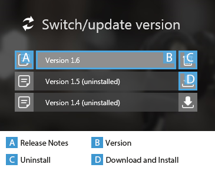
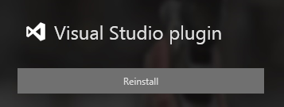
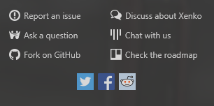
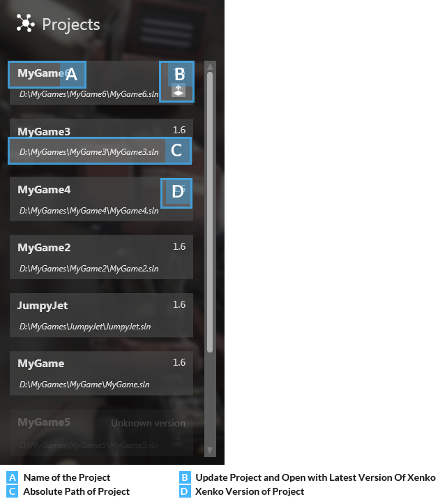
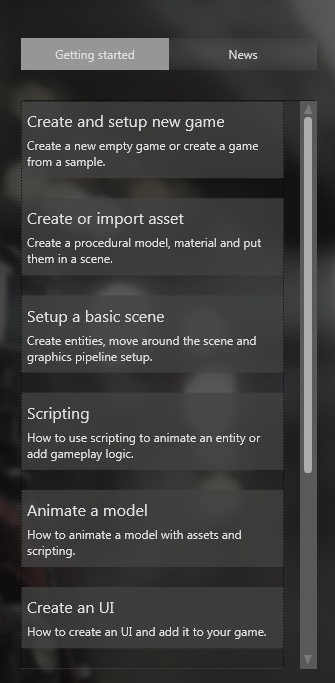

# Xenko launcher

After you install Xenko, the launcher starts immediately. In this topic, let us discuss what all you can do with the Xenko launcher.

Using the Xenko launcher, you can:

*  start Xenko Studio
*  manage different versions of Xenko Studio
*  view release notes of Xenko Studio
*  reinstall the Microsoft Visual Studio plugin
*  access Xenko support and Xenko communities
*  open your recent Xenko projects quickly
*  access Xenko documentation and news streams

   

   *Xenko launcher interface*

## Start Xenko Studio

You can start Xenko Studio from this section.

If the version installed is not the latest version, the Start button displays the text “Install latest version”. Click the **Install latest version** button to get the latest version installed.

   

   *Install latest version button of Xenko launcher*

On the Start button, you can see the currently installed version of Xenko Studio. Click the Start button to start the displayed version of Xenko.

   

   *Start button of Xenko launcher*

>**Note:** If you select the **Close the launcher after starting Xenko** check box, the launcher closes after starting Xenko Studio. If you prefer keeping the launcher open, you can clear the **Close the launcher after starting Xenko** check box.

## Switch or update versions

Xenko launcher can manage different versions of the Xenko SDK. When the Xenko installation is over, click the required version button and then click the Start button. Xenko Studio is launched and you are ready to create your first game!

>**Note:** While updating an existing version, you can choose either a major or a minor version to install. However, once that version is installed, you cannot revert to a bug fix version.

*  Click the release notes button to view the release notes of a Xenko version.
*  Click the download and install button to download and install the required Xenko version.
*  Click the uninstall button to uninstall a Xenko version.

   

   *Various versions of Xenko*

## Visual Studio plugin

After you download your first Xenko SDK, the launcher prompts to install the Visual Studio plugin. Installing this plugin is not mandatory. However, we highly recommend you to install it. Thanks to this plugin, you can edit your shaders directly from Visual Studio.

This plugin provides:

* syntax highlighting
* live-code-analysis with validation
* error-checking
* navigation (jump to definition)

If you manually remove the Visual Studio plugin, you can always install it again with the **Reinstall** button.

   

   *Visual Studio plugin*

## Xenko support

From this section, you can:

*  report an [issue](https://github.com/SiliconStudio/xenko/issues/) about Xenko to Silicon Studio on GitHub
*  ask a [question](http://answers.xenko.com/index.html) about Xenko on AnswerHub
*  explore the [source code](https://github.com/SiliconStudio/xenko/) of Xenko Game Engine on GitHub
*  discuss Xenko on the Xenko [forum](http://forums.xenko.com/)
*  [chat](https://gitter.im/SiliconStudio/xenko) with Xenko engineers
*  check Xenko [roadmap](https://trello.com/b/FwbjOjjB/xenko-roadmap) on Trello
*  connect with Xenko on [Twitter](https://twitter.com/xenko3d), [Facebook](https://www.facebook.com/xenko3d), and [Reddit](https://www.reddit.com/r/xenko)

   

   *Interacting options*

## Projects

You can open your recent Xenko projects from this section just by a click. Your latest Xenko project is always displayed at the top of this list.

   

   *Projects section*

## Getting started and news

You can access various getting started topics of Xenko Manual and news streams related to Xenko from this section.

Click the **Getting started** tab to view the help topics. To view news streams, click the **News** tab.

   

   *Getting started and News section*

We have discussed what all you can do with Xenko launcher. Let us know about [Xenko Studio](http://doc.xenko.com/latest/manual/xenko-studio/index.html).
